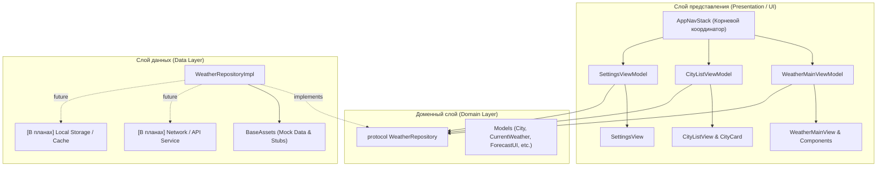

# 🌤️ Weather App iOS (Wetaher_app_IOS)

> **Платформа:** iOS 17.0+ | **Язык:** Swift 5.9+ | **UI-фреймворк:** SwiftUI | **Архитектура:** MVVM.

---

## 📖 Обзор проекта

**Weather App** — приложение для просмотра текущей погоды, почасового и суточного прогнозов, а также детальных метеорологических параметров (ветер, давление, влажность, УФ-индекс, точка росы, время восхода/заката).

### Ключевые возможности:
- **Главный экран погоды:** отображение текущего состояния погоды, почасового прогноза и прогноза на несколько дней.
- **Менеджер городов (Избранное):** поиск городов по названию и стране с дебаунсом (300 мс), сохранение в список избранных, просмотр погоды по всем сохраненным локациям.
- **Темы оформления:** поддержка системной, светлой и тёмной тем с адаптацией фонового цвета и иконок SF Symbols под время суток (день/ночь).
- **Стейт-машина UI:** строгая типизация состояний экранов (`Loading`, `Success`, `Fail`, `Search`) с поддержкой Pull-to-Refresh и механизма повторной загрузки при ошибках.

---

## 🏛 Архитектурный подход

Проект построен по принципам **Clean Architecture** и **MVVM**:



1. **Presentation Layer (UI):**
   - Не зависит от сетевых библиотек или конкретных реализаций базы данных.
   - Использует `WeatherUIState` и `CityListUIState` для явного отображения загрузки, успеха или ошибки.
   - ViewModels помечены `@Observable` и `@MainActor`, что исключает гонки потоков при обновлении интерфейса.
2. **Domain Layer:**
   - Определяет контракты взаимодействия через протокол `WeatherRepository`.
   - Не содержит зависимостей от UIKit / SwiftUI (за исключением визуальных свойств `WeatherCondition` и `AppThemeProps` на текущем этапе).
3. **Data Layer:**
   - Реализует протоколы домена (`WeatherRepositoryImpl`).
   - На текущем этапе симулирует сетевые задержки (`Task.sleep`), рандомизированные ошибки и отдаёт подготовленные моковые данные.

---

## 📂 Подробная структура проекта

```
Wetaher_app_IOS/
├── App/
│   └── WeatherApp.swift                    # Точка входа в приложение (@main App)
│
├── Domain/
│   └── WeatherRepository.swift             # Интерфейс (протокол) репозитория погоды
│
├── Data/
│   └── WeatherRepositoryImpl.swift         # Реализация репозитория (сейчас моковая)
│
├── Models/
│   ├── City.swift                          # Модель города (id, name, lat, lon, timeZoneID)
│   ├── CurrentWeather.swift                # Текущая погода (температура, ветер, давление и др.)
│   ├── HourlyWeather.swift                 # Почасовой прогноз погоды
│   ├── DailyWeather.swift                  # Дневной прогноз погоды (min/max, восход/закат)
│   ├── ForecastUI.swift                    # Агрегирующая модель прогноза для UI
│   ├── WeatherCondition.swift              # Текущее состояние погоды (Код погоды, описание, иконки SF Symbols, палитры используемых фоновых цветов)
│   ├── WeatherErrorUI.swift                # Модель ошибки (код, описание, протокол Error)
│   └── AppThemeProps.swift                 # Модель выбора темы приложения (System, Light, Dark)
│
├── UI/
│   ├── AppNavStack.swift                   # Корневой экран, роутинг, показ sheets, внедрение зависимостей
│   │
│   ├── ScreenState/                        # Стейты экранов и базовые контейнеры состояний
│   │   ├── WeatherUIState.swift            # Enum состояний главного экрана (.Loading, .Success, .Fail)
│   │   ├── CityListUIState.swift           # Enum состояний списка городов (.Loading, .Success, .Fail, .Search)
│   │   ├── WeatherSuccess.swift            # Экран успешной загрузки с кнопками настроек и городов
│   │   └── WeatherError.swift              # Экран ошибки с кнопкой "Повторить"
│   │
│   └── Pages/                              # Экраны приложения (MVVM)
│       ├── Main/                           # Главный экран с прогнозом
│       │   ├── WeatherMainView.swift       # Главный скролл-контейнер и сетка виджетов
│       │   ├── WeatherMainViewModel.swift  # Бизнес-логика главного экрана
│       │   └── Components/                 # Виджеты главного экрана
│       │       ├── CurrentWeatherHeader.swift # Карточка с текущей температурой и городом
│       │       ├── HourlyForecast.swift       # Карусель почасового прогноза
│       │       ├── DailyForecast.swift        # Список прогноза на несколько дней
│       │       ├── WeatherBackground.swift    # Фон экрана под тему/погоду
│       │       └── WeatherMetricCard.swift    # Карточки метрик (ветер, давление, влажность и т.д.)
│       │
│       ├── Cities/                         # Экран списка городов и поиска
│       │   ├── CityListView.swift          # Интерфейс модального окна со списком городов
│       │   ├── CityListViewModel.swift     # Логика поиска с debounce, добавление/удаление
│       │   └── Components/
│       │       └── CityCard.swift          # Карточка отдельного города в списке
│       │
│       └── Settings/                       # Экран настроек
│           ├── SettingsView.swift          # Интерфейс настроек темы
│           └── SettingsViewModel.swift     # ViewModel управления настройками
│
├── Resources/
│   └── Assets/
│       └── BaseAssets.swift                # База моковых городов и тестовые прогнозы
│
└── Assets.xcassets/                        # Цветовые наборы и графические ресурсы Xcode
```

---

## 🚀 Следующие шаги

### 1. Доработка компонентов UI

Заполнение верстки в директории [UI/Pages/Main/Components/](https://github.com/Roman194/Wetaher_app_IOS/tree/feature/architecture/Wetaher_app_IOS/UI/Pages/Main/Components):

| Файл | Что добавить |
|---|---|
| [WeatherBackground.swift](https://github.com/Roman194/Wetaher_app_IOS/blob/feature/architecture/Wetaher_app_IOS/UI/Pages/Main/Components/WeatherBackground.swift) | Простая заливка сплошным цветом (`Solid Color`), адаптирующимся под тему (светлая/тёмная) или время суток (`isDay`), через системные цвета SwiftUI (`Color(uiColor: .systemBackground)`) без использования тяжелых градиентов и анимаций. |
| [WeatherMetricCard.swift](https://github.com/Roman194/Wetaher_app_IOS/blob/feature/architecture/Wetaher_app_IOS/UI/Pages/Main/Components/WeatherMetricCard.swift) | Реализовать карточки: `WindMetricCard` (скорость и направление ветра), `PressureMetricCard` (давление в мм рт. ст.), `HumidityMetricCard` (влажность и точка росы), `UVMetricCard`, `SunTimesMetricCard` (рассвет/закат), `VisibilityMetricCard`. Оформить в едином стиле карточек. |
| [HourlyForecast.swift](https://github.com/Roman194/Wetaher_app_IOS/blob/feature/architecture/Wetaher_app_IOS/UI/Pages/Main/Components/HourlyForecast.swift) | Горизонтальный `ScrollView` со списком часов: время, иконка SF Symbol, температура, вероятность осадков. |
| [DailyForecast.swift](https://github.com/Roman194/Wetaher_app_IOS/blob/feature/architecture/Wetaher_app_IOS/UI/Pages/Main/Components/DailyForecast.swift) | Вертикальный стек прогноза на 7 дней с полосой температурного диапазона (min/max). |
| [CityCard.swift](https://github.com/Roman194/Wetaher_app_IOS/blob/feature/architecture/Wetaher_app_IOS/UI/Pages/Cities/Components/CityCard.swift) | Карточка города для `CityListView`: название, страна, время в таймзоне города, текущая температура, погодные условия. |
| [CityListView.swift](https://github.com/Roman194/Wetaher_app_IOS/blob/feature/architecture/Wetaher_app_IOS/UI/Pages/Cities/CityListView.swift) | Полноценный интерфейс поиска со строкой `searchable`, списком результатов и списком избранных городов со свайпом для удаления (`swipeActions`). |

---

### 2. Вынесение констант в Resources

Для устранения дублирования «магических чисел», строк и цветов вынести константы проекта в структурированные файлы в директории `Resources/`:

- **Цвета (`Resources/Colors/`):**
  - `Colors.swift` — семантические цвета интерфейса (фон карточек, цвет текста, индикаторы состояний).
  - `BaseColors.swift` — базовая палитра приложения (HEX/RGB значения, системные оттенки).
- **Константы (`Resources/Constants/`):**
  - `BaseText.swift` — строковые константы и статический текст UI (заголовки экранов, плейсхолдеры поиска, подписи метрик для удобной будущей локализации).
  - `BaseNumeral.swift` — числовые константы (размеры отступов `padding`, скругления углов `cornerRadius`, задержки дебаунса `searchDebounceDuration`, сетки `gridSpacing`).
